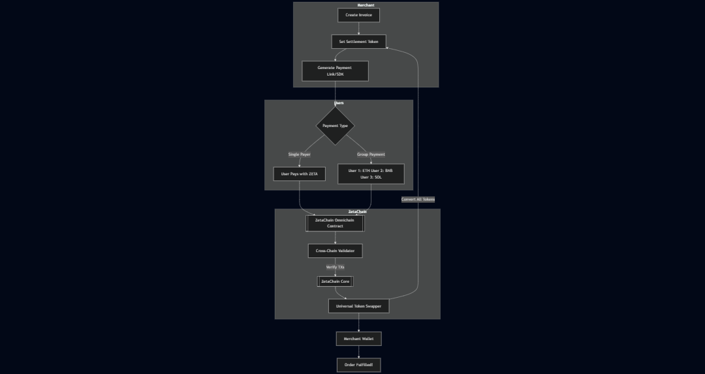

# 💸 PayBeam

> Seamless crypto payments for modern merchants, powered by **ZetaChain** and **Stellar**.

## 🌟 Inspiration

Managing group or third-party payments is often a pain. Whether you're splitting a dinner bill, buying an Airbnb with friends, or managing recurring subscriptions like Spotify Family, the process typically involves manual effort, multiple apps, and unnecessary friction.

**PayBeam** solves this by enabling **multi-party**, **multi-token**, and **omnichain** payments—all while abstracting the complexities of crypto from both the business owner and the user. Our goal is to make crypto feel like magic to everyday people and businesses.

---

## ⚙️ How PayBeam Works

There are currently three major user flows supported by PayBeam:

1. Businesses integrating via our SDK
2. Merchants generating payment links via our web app
3. PayBeam Wallet (coming soon)

Despite different entry points, all payment flows interact with the same smart contract infrastructure for seamless backend processing and omnichain moderation.

---

### 🧩 1. Businesses Using Our SDK

Take **Stanly**, a cookie store owner. Stanly already uses Stripe for fiat payments but has customers who want to pay in crypto; sometimes splitting payments with friends or sending the invoice to someone else entirely.

Stanly integrates PayBeam's SDK into her checkout system. Her customers can now:

- Pay in any token on supported chains (e.g. ETH, USDT, BNB, etc.)
- Split the bill with multiple wallets or friends
- Complete the payment using any supported blockchain

On the backend, Stanly simply receives her desired settlement token say **USDC** or **$ZETA** automatically, regardless of how the payment came in.

---

### 🔗 2. Merchants Generating Links on Our Website

Consider **Ada**, an Instagram vendor selling perfumes in Nigeria. She’s not technical but has crypto-savvy customers.

Using our simple web dashboard, she generates a payment link for each customer or order. That link:

- Accepts payment in multiple tokens and chains
- Allows customers to split payments however they like
- Settles to Ada’s wallet in **$ZETA** or any other supported stablecoin

---

### 👥 3. Group Subscriptions: Joseph & Friends on Spotify

**Joseph** pays for a monthly Spotify Family plan shared with four friends. Coordinating payments is a nightmare, and Spotify won’t accept group splits in crypto.

With PayBeam:

- Joseph sets up a **recurring invoice**
- Each friend pays their portion in a different token or on a different chain
- PayBeam monitors and aggregates the payments
- Once the full invoice is fulfilled, PayBeam automatically settles to Joseph in **$ZETA**, ready for Spotify's auto-charge

---

## 🚀 Why PayBeam is Powerful

No matter the interface (SDK, Web, Wallet):

- Users can **pay in different tokens**
- Payments can be **split across wallets or friends**
- Merchants **always receive** the token they prefer
- Works across **multiple blockchains**
- Requires **no crypto knowledge** from merchants

---

## 🧠 How It Works Under the Hood (ZetaChain Magic)

### Smart Contract Flow (Visualized)

At the core of PayBeam is a **single smart contract on ZetaChain**—our universal transaction coordinator.

### 🔄 Omnichain Moderation Layer

We leverage **ZetaChain’s omnichain smart contract functionality** to:

- Receive incoming payments from various blockchains and tokens
- Monitor each participant’s contribution to an invoice (even across chains)
- Automatically convert/swap all incoming tokens into a target token (e.g. $ZETA or USDC)
- Trigger invoice fulfillment logic and notify the merchant or developer

This is all done via **a single, unified ZetaChain smart contract**, which acts as the backend payment settlement layer. Thanks to ZetaChain’s native omnichain infrastructure, we don’t need separate contracts on each chain, nor do we require any special user-side bridging. Everything is handled behind the scenes.

### 🪙 Example: $100 Invoice in $ZETA

Let’s say a merchant generates a $100 invoice and wants to be paid in **$ZETA**.

- Alice pays $40 in **ETH** on Ethereum
- Bob pays $30 in **BNB** on BNB Chain
- Clara pays $30 in **USDT** on Polygon

Our ZetaChain smart contract:

1. Accepts all three payments from different chains
2. Tracks and aggregates the total paid amount
3. Swaps all received tokens to **$ZETA**
4. Releases the $100 worth of ZETA to the merchant’s address
5. Marks the invoice as fulfilled

All this without the merchant ever needing to know what ETH, BNB, or USDT are.

---

## 🧱 Technical Architecture

We maintain multiple open-source and internal repositories powering PayBeam:

| Layer | Repo | Description |
|------|------|-------------|
| 🔌 Modal Library | [npm](https://www.npmjs.com/package/paybeam-modal-library) | Plug-and-play modal for PayBeam checkout |
| ⚙️ ZetaChain Contract | [deployed contract](https://github.com/payBeam/payBeam-ZETA) | Smart contract that moderates omnichain payments |
| 🔗 Stellar Contract | [GitHub Link](https://github.com/payBeam/payBeam-soroban-contract) | Stellar-specific contract to support stablecoin settlements |
| 🧠 Zetachain codebase | [solidty code](https://github.com/backend) | Handles off-chain invoice logic, signature generation, and webhook notifications |
| 🧠 Backend API (Node.js) | [backend](https://github.com/backend) | Handles off-chain invoice logic, signature generation, and webhook notifications |
| 🖥️ Frontend Web App | [frontend](https://github.com/Paybeam) | Merchant dashboard, invoice creation, and payment tracking |
| 🌍 PayBeam Website | [getpaybeam.xyz](https://getpaybeam.xyz) | Marketing and onboarding portal |
| 🐦 Twitter/X | [X](https://x.com/paybeam_hq) | Latest updates |
| 💬 Discord | [Discord](https://discord.gg/zrKr7EVZwS) | Community, support, and product feedback |
| 📊 Pitch Deck | [Pitch Deck Link](https://www.canva.com/design/DAGem4zFsac/51pkjQd2S0MDsZRZb-j28w/edit?utm_content=DAGem4zFsac&utm_campaign=designshare&utm_medium=link2&utm_source=sharebutton) | Full vision, roadmap, and funding details |

---

## 🤝 Why ZetaChain?

PayBeam chose **ZetaChain** because it allows us to:

- Write **one contract** for all chains
- Eliminate complex bridging UX for end users
- Handle **cross-chain token swaps** natively
- Ensure **fast, secure, and deterministic** payment flow
- Simplify developer and merchant integration

Our dream of abstracting crypto complexity for real-world use cases is only possible because of ZetaChain's architecture. We’re not just building on ZetaChain—we’re betting on it.

---

## 👋 Let’s Talk

We’re excited to push crypto into the mainstream with tools that feel intuitive, accessible, and human-first. If you’re interested in collaborating, funding, or integrating PayBeam:

→ **Email**: dunsin@getpaybeam.xyz  
→ **Telegram**: [@Dunsin_A](https://web.telegram.org/k/#@Dunsin_A)  
→ **Join our Discord**: [https://discord.gg/zrKr7EVZwS](https://discord.gg/zrKr7EVZwS)

---

> PayBeam – “Crypto Payments That Just Work.”
